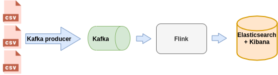
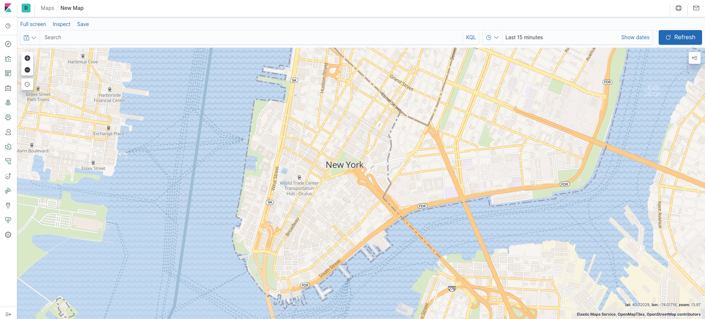

# nyc-taxi-flink



1. Download data:
```
cd data
wget http://www.cs.put.poznan.pl/kjankiewicz/bigdata/stream_project/taxi_zone_lookup.csv
wget http://www.cs.put.poznan.pl/kjankiewicz/bigdata/stream_project/yellow_tripdata_result.zip
unzip yellow_tripdata_result.zip
```

Run elasticsearch 
```
cd /home/dhorna/dev/tools/elasticsearch/elasticsearch-7.6.2
./bin/elasticsearch
```

Run kibana:
```
cd /home/dhorna/dev/tools/kibana/kibana-7.6.2-linux-x86_64
./bin/kibana
```

Start DeparturesArrivalsCount.scala

Start broker:
```
systemctl start zookeeper
systemctl start kafka
```

To check if running:
```
systemctl status kafka
```

Run Kafka producer:
```
java -cp /usr/lib/kafka/libs/*:KafkaProducer.jar  com.example.bigdata.TestProducer data/yellow_tripdata_result/ 5 testTopic  0 localhost:9092
```

Open http://localhost:5601/ for Kibana.

